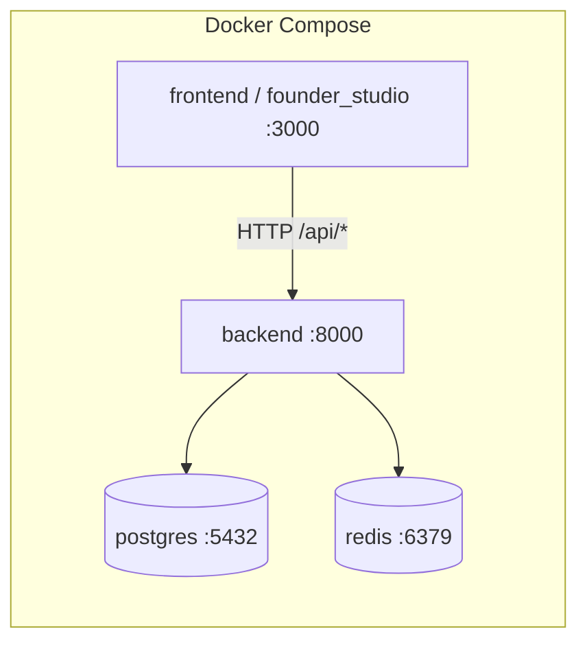

# AIONE OS v0.1.0-alpha — Release Report

**Phase:** Alpha Freeze  
**Date:** 2026-06-24  
**Version:** `0.1.0-alpha`

---

## Executive Summary

AIONE has reached **alpha freeze** with a working vertical slice: Django REST backend (auth, health, projects), Founder Studio Flutter client, and Docker Compose runtime for local and containerized development. Documentation was reconciled with the implementation. All targeted validation commands pass.

**Alpha readiness score: 78 / 100**

| Category | Score | Weight | Weighted |
| -------- | ----- | ------ | -------- |
| Repository & docs | 85 | 20% | 17.0 |
| Architecture alignment | 82 | 20% | 16.4 |
| Implemented modules | 80 | 25% | 20.0 |
| Test & CI health | 90 | 20% | 18.0 |
| Production readiness | 45 | 15% | 6.8 |
| **Total** | | | **78.2** |

---

## Repository Status

### Layout

| Path | Status | Notes |
| ---- | ------ | ----- |
| `apps/founder_studio/` | **Active** | Flutter client, 96+ source files |
| `services/backend/` | **Active** | Django 5.1, 4 domain apps |
| `docs/` | **Active** | 5 ADRs + 4 standards |
| `planning/` | **Active** | Roadmap, backlog, debt register |
| `packages/` | Scaffold | Empty — reserved per ADR 0001 |
| `infrastructure/` | Scaffold | Empty — no IaC yet |
| `scripts/` | Scaffold | Empty — no automation yet |
| `tests/` | Scaffold | Empty — no cross-repo E2E yet |

### Version alignment

| Component | Version constant | Location |
| --------- | ---------------- | -------- |
| Backend platform | `0.1.0-alpha` | `services/backend/apps/core/version.py` |
| Founder Studio | `0.1.0-alpha` | `apps/founder_studio/lib/core/constants.dart` |
| Changelog | `0.1.0-alpha` | `CHANGELOG.md` |

### Documentation freeze actions (this pass)

- `README.md` — rewritten for alpha implementation
- `CHANGELOG.md` — alpha features documented
- `docs/adr/README.md` — ADR index populated (0001–0005)
- `apps/founder_studio/README.md` — project-specific guide
- `.env.example` — placeholder section headers removed
- `SECURITY.md` — GitHub Security Advisories + alpha contact
- `.github/ISSUE_TEMPLATE/bug_report.md` — `apps/founder_studio` reference
- `planning/technical_debt.md` — TD-001–004 marked repaid

### Internal link verification

Manual and scripted review of markdown cross-references:

- All `docs/adr/`, `docs/standards/`, and `planning/` relative links resolve.
- Root `README.md` anchor links and file references resolve.
- Template-only references (`NNNN-title.md` in ADR template) are intentional examples, not live links.
- GitHub-relative paths in `.github/PULL_REQUEST_TEMPLATE.md` resolve correctly on GitHub (not filesystem-relative).

---

## Architecture Status

### Monorepo strategy (ADR 0001)

Monorepo layout is in place. Active code lives in `apps/` and `services/`; shared and platform directories exist as scaffolds.

### Flutter client (ADR 0002)

Founder Studio follows clean architecture:

```
presentation/ → application/ → domain/ ← infrastructure/
```

- **Routing:** GoRouter with auth guards (`/`, `/login`, `/dashboard`, `/settings`, `/profile`, `/projects/:id`)
- **State:** Riverpod providers for auth, projects, theme, locale, health
- **i18n:** English + Arabic (`lib/l10n/`)
- **Storage:** `flutter_secure_storage` for JWT tokens

### Django backend (ADR 0003)

Layered structure per app: `models` → `services/` → `api/`.

| App | Layering | Tests |
| --- | -------- | ----- |
| `core` | Version metadata | — |
| `health` | Service + API | `test_health_api.py` |
| `accounts` | User model, auth service, JWT middleware | `test_auth_api.py`, `test_auth_service.py` |
| `projects` | Project model, service, DRF viewset | `test_project_api.py`, `test_project_service.py` |

### Future architecture (ADR 0004, 0005)

- **Generator-driven development** — not started; contracts are hand-written (TD-005)
- **Knowledge graph** — ADR accepted; `docs/knowledge-graph/` not yet populated (TD-015)

### Runtime topology



---

## Implemented Modules

### Authentication

| Layer | Capability |
| ----- | ---------- |
| Backend | JWT login, refresh, verify, logout, `/api/auth/me/`; custom email-based `User` model; token blacklist |
| Client | Login page, secure token storage, session restore on splash, auth-guarded routes, logout |
| Gap | No registration API; users via Django admin only (TD-017) |

### Project CRUD

| Layer | Capability |
| ----- | ---------- |
| Backend | Full REST CRUD on `/api/projects/`; filter/search/order; per-user ownership |
| Client | Dashboard list, create dialog, detail page, edit, delete confirmation |
| Model | `name`, `description`, `status`, `color`, `icon`, timestamps |

### Founder Studio

| Feature | Status |
| ------- | ------ |
| Dashboard + empty state | Done |
| Project cards and navigation | Done |
| Settings (theme, locale, version) | Done |
| Connection status widget | Done |
| Profile page | Placeholder UI (TD-018) |
| Health page | Implemented, not routed (TD-016) |

### Alpha runtime

| Asset | Status |
| ----- | ------ |
| `services/backend/Dockerfile` | Gunicorn + healthcheck |
| `apps/founder_studio/Dockerfile` | Multi-stage Flutter web → nginx |
| `docker-compose.yml` | `postgres` + `redis` default; `app` profile for full stack |
| Health orchestration | Backend `/api/health/` used in Compose healthchecks |

---

## Known Gaps

| ID | Gap | Impact |
| -- | --- | ------ |
| G-01 | Empty `packages/`, `scripts/`, `infrastructure/`, `tests/` | No shared libs, codegen, deploy, or E2E |
| G-02 | No user registration flow | Alpha requires admin-created accounts |
| G-03 | No production deployment manifests | Cannot ship beyond local/Compose |
| G-04 | Hand-written API contracts | Drift risk between Flutter and Django |
| G-05 | Knowledge graph not materialized | Limited cross-artifact navigation |
| G-06 | `HealthPage` unrouted | Dead code path in navigation |
| G-07 | Profile screen placeholder | Incomplete founder profile UX |
| G-08 | No `CODEOWNERS` | Review routing undefined |
| G-09 | Alpha security email (`security@aione.dev`) | Production contact TBD before beta |

---

## Technical Debt

Active items after alpha freeze repayment (see `planning/technical_debt.md`):

| Priority | IDs | Theme |
| -------- | --- | ----- |
| High | TD-005, TD-009 | Generator contracts; cross-cutting tests |
| Medium | TD-006–008, TD-010–011, TD-013, TD-015, TD-017 | Scaffold dirs, ops, logging, KG, registration |
| Low | TD-012, TD-014, TD-016, TD-018 | Naming, RBAC scope, unrouted pages, placeholder UI |

**Repaid in alpha freeze:** TD-001 (README), TD-002 (CHANGELOG), TD-003 (app README), TD-004 (ADR index), TD-011 partial (security reporting path).

---

## Validation Results

Executed on 2026-06-24:

| Command | Directory | Result |
| ------- | --------- | ------ |
| `flutter analyze` | `apps/founder_studio` | **PASS** — No issues found |
| `flutter test` | `apps/founder_studio` | **PASS** — 10/10 tests passed |
| `python manage.py test` | `services/backend` | **PASS** — 17/17 tests passed |

### Test inventory

**Backend (17 tests)**

- `accounts/tests/test_auth_api.py` — login, me, refresh, verify, logout
- `accounts/tests/test_auth_service.py` — auth service unit tests
- `health/tests/test_health_api.py` — public health endpoint
- `projects/tests/test_project_api.py` — CRUD, auth, ownership isolation
- `projects/tests/test_project_service.py` — project service unit tests

**Founder Studio (10 tests)**

- Domain: `project_test.dart`
- Presentation: login, dashboard, health page, empty state, project card

---

## Recommendations

### Before beta (priority order)

1. **User registration** — self-service signup or invite flow (TD-017)
2. **Cross-cutting E2E** — smoke test in `tests/` against Compose stack (TD-009)
3. **Generator pipeline** — canonical OpenAPI/models → Dart + Python clients (TD-005, ADR 0004)
4. **Infrastructure baseline** — staging deploy path in `infrastructure/` (TD-008)
5. **Security hardening** — production security contact, `CODEOWNERS`, structured audit logging

### Alpha maintenance (low risk)

1. Wire `HealthPage` into router or remove until needed (TD-016)
2. Complete profile screen or hide nav entry until beta (TD-018)
3. Populate `docs/knowledge-graph/` per ADR 0005 Phase 1 (TD-015)

### Do not do in alpha

- New business features or API changes
- Architecture redesign
- Production feature flags or multi-tenant RBAC expansion

---

## Alpha Readiness Verdict

| Criterion | Met? |
| --------- | ---- |
| Vertical slice (auth + projects + client) | Yes |
| Documented and link-verified | Yes |
| Local + Docker runtime | Yes |
| Unit/integration tests passing | Yes |
| Generator / KG / deploy pipeline | No |
| Production-ready security & ops | No |

**Verdict:** Ready for **internal alpha** distribution and founder testing. Not ready for public beta or production without addressing G-02, G-03, G-04, and G-09.

**Final alpha readiness score: 78 / 100**

---

*Generated as part of AIONE OS v0.1-alpha freeze. No application code or APIs were modified in this pass.*
